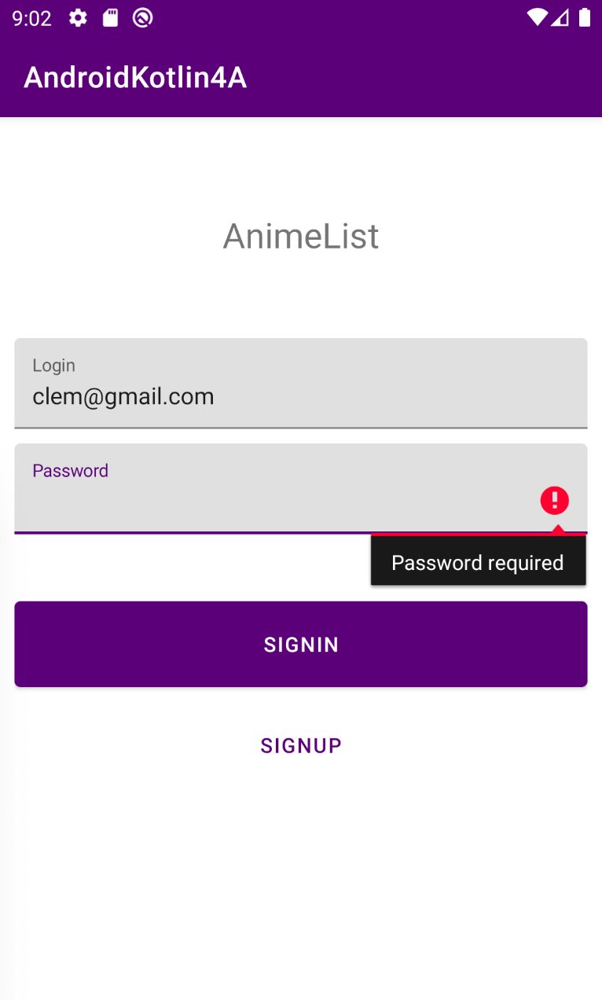

# Projet 4A
Réalisation d'une application présentant la liste des animés du Studio Ghibli, réalisée par Clément Sorel (classe 43).

## Présentation
Cette application a été codée en Kotlin. Elle affiche un premier écran sur lequel est présenté un formulaire, demandant à renseigner un Login et un mot de passe. 
Si le compte est inconnu, un deuxième écran donne la possibilité de créer son compte. Une fois le compte enregistré, l'utilisateur peut se connecter et avoir enfin accès à un troisième écran de bienvenue présentant un bouton pour accéder à liste des différents animés du Studio Ghibli affichant : 
- Le titre du film
- Le producteur

## Prérequis
- Installation d'Android Studio
- Réalisation des TDs

## Consignes respectées
- Utilisation du langage Kotlin
- Architecture MVVM
- Clean Architecture
- Utilisation d'une réelle BDD
- Affichage d'une liste d'éléments
- Appel WebService à une API Rest

## Présentation des fonctionnalités de l'application :

### Premier écran
#### Présentation d'un formulaire

  

L'utilisateur doit obligatoirement renseigner les champs "Login" et "Password" pour se connecter à l'application. Si son compte est inconnu un message d'erreur s'affichera et il sera invité à créer un compte.

### Deuxième écran
#### Création du compte 

Une fois tous les champs renseignés, l'utilisateur est ensuite renvoyé sur le premier écran afin qu'il puisse se connecter avec les identifiants qu'il a créé.

### Troisième écran
#### Page de Bienvenue

L'utilisateur peut maintenant accéder à liste des films en cliquant sur le bouton "MOVIES".

### Dernier écran
#### Affichage de la liste des films

